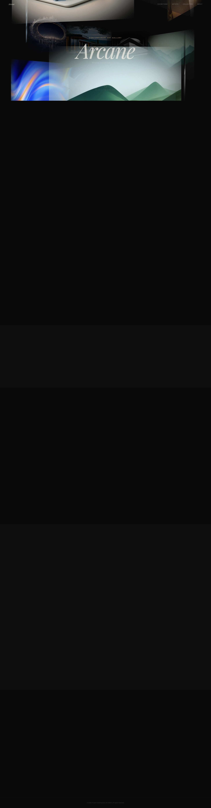

# Arcane Gallery

A cinematic 3D spiral art gallery website built with Three.js, GLSL shaders, Lenis smooth scroll, and GSAP ScrollTrigger. Designed as a premium dark-editorial landing page for contemporary art galleries, creative studios, and portfolios.



## Features

- **3D Spiral Gallery** — 15 image tiles arranged in a helical spiral, built from custom `BufferGeometry` with curved surfaces
- **GLSL Shaders** — Custom vertex and fragment shaders with per-tile vignette and depth-based fade
- **Lenis Smooth Scroll** — Scroll velocity directly drives spiral rotation speed
- **GSAP ScrollTrigger** — Sticky hero pin, text reveals with fade-up animations, scroll-linked rotation
- **Mouse Parallax** — Subtle tilt on X/Y axes as the cursor moves
- **Film Grain Overlay** — SVG `<feTurbulence>` noise with CSS animation
- **Scroll Icon** — Animated mouse indicator above "Scroll to explore"
- **Fixed Navigation** — Transparent navbar with blur backdrop on scroll
- **Full Art Gallery Sections** — Current exhibition, upcoming shows, featured artists, collection categories, about/visit info
- **Aura Asset Images** — High-resolution editorial photography from the Aura Asset Library
- **Responsive** — Adapts to mobile, tablet, and desktop viewports
- **Dark Editorial Palette** — Deep charcoal background, warm ivory typography, gold accents

## Tech Stack

| Layer | Technology |
|---|---|
| 3D Engine | Three.js (custom BufferGeometry, ShaderMaterial) |
| Shaders | GLSL (vertex + fragment) |
| Smooth Scroll | Lenis |
| Scroll Animation | GSAP + ScrollTrigger |
| Build | Vite |
| Fonts | Playfair Display, DM Sans |
| Language | Vanilla JavaScript (ES Modules) |
| Images | Aura Asset Library |

## Getting Started

```bash
npm install
npm run dev
```

Open `http://localhost:5173` in your browser.

## Build

```bash
npm run build
npm run preview
```

## Project Structure

```
arcane-gallery/
├── index.html              # Main HTML with art gallery sections
├── package.json
├── vite.config.js
├── .gitignore
├── screenshot.png
└── src/
    ├── main.js             # Lenis + GSAP ScrollTrigger setup
    ├── style.css           # Dark editorial theme, responsive
    ├── spiral.js           # Three.js spiral scene, tiles, shaders
    └── shaders/
        ├── vertex.glsl     # UV + depth pass-through
        └── fragment.glsl   # Texture, vignette, depth fade
```

## License

MIT
